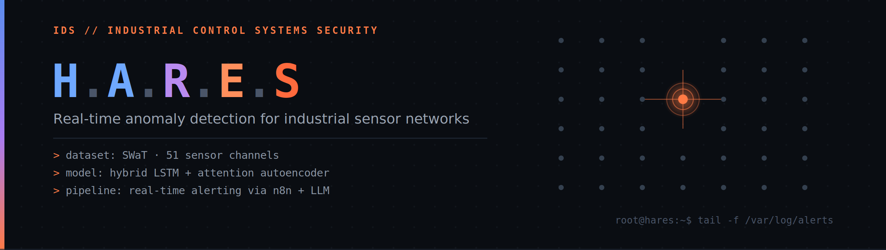
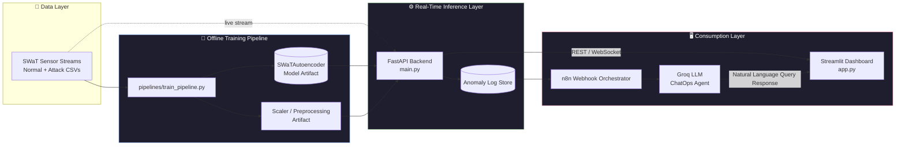

<div align="center">

# ⚡ Anomify: Real-Time IoT Anomaly Detection

### Production-Grade AI System for Detecting Cyberattacks in Industrial Sensor Streams

<p align="center">


</p>

---

## 🌟 Project Banner



---

### 📌 Real-Time Anomaly Detection on the SWaT Industrial Testbed — Powered by a Custom Autoencoder & LLM ChatOps

</div>

---

# 📖 Overview

**Anomify** is a decoupled, production-grade MLOps system for detecting cyberattacks hidden inside industrial IoT sensor telemetry. Built on the **SWaT (Secure Water Treatment)** dataset — 51 sensor/actuator channels across 6 process stages — the system learns the reconstruction manifold of *normal* plant behavior using a custom deep **Autoencoder**, and flags any sample whose reconstruction error exceeds a statistically calibrated threshold.

The pipeline separates offline model training from real-time inference: a FastAPI backend continuously scores incoming sensor streams, a Streamlit dashboard visualizes anomalies live, and an **n8n + Groq LLM ChatOps agent** lets operators query the anomaly history in plain English — no SQL required.

---

# ✨ Key MLOps Features

- 🔁 **Decoupled Train/Serve Architecture** — model artifacts are versioned independently from the inference service
- 📥 **Robust Data Ingestion** — Pandas/PyArrow-backed loaders with optimized dtype handling for high-volume sensor CSVs
- 🧩 **Modular, Config-Driven Design** — preprocessing, model, and thresholding logic isolated in `src/`, parameters externalized to `configs/`
- ⚡ **Real-Time Scoring & Alerting** — FastAPI scores streaming samples against a calibrated reconstruction-error threshold
- 🤖 **LLM-Augmented ChatOps** — Groq LLM orchestrated via n8n webhooks for natural-language querying of anomaly logs
- 📊 **Live Monitoring Dashboard** — Streamlit-based real-time visualization of sensor streams and alerts
- 🧵 **Deterministic Threading Control** — explicit OpenBLAS/oneDNN thread configuration to prevent memory blow-up on inference hosts
- 🧪 **Reproducible Environments** — pinned `requirements.txt`, isolated `.venv`, module-based launchers

---

# 🏗 System Architecture




---

# 📂 Repository Structure

```text
anomify/
├── configs/                   # Environment & model hyperparameter configs (YAML/JSON)
│   └── model_config.yaml
│
├── data/
│   └── raw/                   # SWaT normal & attack CSVs (not version-controlled)
│       ├── SWaT_Normal.csv
│       └── SWaT_Attack.csv
│
├── pipelines/
│   ├── train_pipeline.py      # End-to-end training entrypoint (preprocess → fit → export)
│   └── inference.py           # Batch/offline scoring entrypoint
│
├── src/
│   ├── data/                  # Ingestion & preprocessing (Pandas/PyArrow loaders, scalers)
│   ├── models/
│   │   └── swat_autoencoder.py   # Custom SWaTAutoencoder (TensorFlow/Keras)
│   ├── inference/             # Real-time scoring logic, threshold calibration
│   └── utils/                 # Logging, env/thread configuration helpers
│
├── notebooks/                 # EDA & experimentation notebooks
├── docs/                      # Architecture, UML diagrams, screenshots
├── artifacts/                 # Trained model weights + fitted scalers (generated)
│
├── main.py                    # FastAPI application entrypoint (inference API)
├── app.py                     # Streamlit dashboard entrypoint
│
├── requirements.txt
├── .env.example
└── README.md
```

---

# ⚙ Tech Stack

| Layer | Technology | Usage |
|---|---|---|
| **Machine Learning** | TensorFlow / Keras | Custom `SWaTAutoencoder` |
| | Scikit-learn | Preprocessing, scaling, evaluation metrics |
| | Pandas / PyArrow | Optimized data loading for high-volume CSVs |
| **Backend / API** | FastAPI + Uvicorn | Real-time inference REST service |
| **Frontend** | Streamlit | Live monitoring dashboard |
| **ChatOps / Automation** | n8n | Webhook-driven orchestration |
| | Groq LLM | Natural-language querying of anomaly logs |
| **Infrastructure** | Python 3.11 | Core runtime |
| | `.venv` | Isolated, reproducible environments |
| | OpenBLAS / oneDNN env config | Thread & memory optimization |

---

# 🔄 System Workflow

```text
SWaT Sensor Streams
        │
        ▼
  Data Ingestion (Pandas/PyArrow)
        │
        ▼
    Preprocessing & Scaling
        │
        ▼
  SWaTAutoencoder (Inference)
        │
        ▼
   Reconstruction Error Scoring
        │
   ┌────┴────┐
   │         │
   ▼         ▼
 Normal   Anomaly
   │         │
   ▼         ▼
Dashboard   Alert → n8n Webhook → Groq LLM ChatOps
```

---

# 📊 UML & Design Diagrams

## 🧩 Class Diagram


## 🎯 Use Case Diagram


## 🔄 Activity Diagram


## ⏱ Sequence Diagram — Model Training


## ⏱ Sequence Diagram — Real-Time Inference


## ⏱ Sequence Diagram — Alert & ChatOps Agent


## 🧱 Component Diagram


## 🖥 Deployment Diagram


## 🗄 ER Diagram (Anomaly Log Store)


---

# 📈 ML Lifecycle Pipeline

```text
Load SWaT Dataset (Normal + Attack)
        │
        ▼
  Preprocessing & Feature Scaling
        │
        ▼
  Train SWaTAutoencoder
        │
        ▼
  Threshold Calibration (Reconstruction Error)
        │
        ▼
  Evaluate (Precision / Recall / F1 / ROC-AUC)
        │
        ▼
  Export Artifacts → artifacts/
        │
        ▼
  Real-Time Inference (FastAPI)
```

---

# 📸 Screenshots

## Live Dashboard


## Anomaly Prediction


## Alert Management


## ChatOps Assistant


---

# 📊 Model Performance

| Metric | Value |
|---|---:|
| Accuracy | XX % |
| Precision | XX % |
| Recall | XX % |
| F1 Score | XX % |
| ROC-AUC | XX % |

*(Populate from `pipelines/train_pipeline.py` evaluation output on the SWaT attack split.)*

---

# 🚀 Getting Started (Local Setup)

### 1. Clone & Create Environment

```bash
git clone https://github.com/mohamed-hamada111/Real-Time_Anomaly_Detection_IoT_Sensor_Streams.git anomify
cd anomify

python -m venv .venv

# Windows
.venv\Scripts\activate

# macOS / Linux
source .venv/bin/activate
```

### 2. Install Dependencies

```bash
pip install --upgrade pip
pip install -r requirements.txt
```

### 3. ⚠️ Important — Module-Based Launchers Only

Do **not** invoke `uvicorn` or `streamlit` directly from the shell inside a `.venv`. Global launcher shims often resolve to an absolute path outside the active environment, silently breaking relative imports (`src.*`, `configs.*`) and thread-limit environment variables.

```bash
# ✅ Correct
python -m uvicorn main:app --reload
python -m streamlit run app.py

# ❌ Avoid — may resolve to a stale global install
uvicorn main:app --reload
streamlit run app.py
```

---

# 🧠 ML Lifecycle Execution

### Data Placement

```text
data/raw/
├── SWaT_Normal.csv     # Attack-free baseline — used to fit the autoencoder
└── SWaT_Attack.csv     # Mixed normal + attack traffic — used for calibration/eval
```

### Run the Training Pipeline

```bash
python pipelines/train_pipeline.py
```

This executes: **ingestion → preprocessing/scaling → autoencoder training → threshold calibration → evaluation → artifact export** to `artifacts/`.

---

# ▶ Running the Services

Run concurrently in separate terminals (both inside the activated `.venv`):

**Terminal 1 — FastAPI Backend**
```bash
python -m uvicorn main:app --reload --host 0.0.0.0 --port 8000
```

**Terminal 2 — Streamlit Dashboard**
```bash
python -m streamlit run app.py
```

| Service | Default URL | Purpose |
|---|---|---|
| FastAPI Backend | `http://localhost:8000` | Scoring API, anomaly log endpoints, docs at `/docs` |
| Streamlit Dashboard | `http://localhost:8501` | Live sensor visualization, alert feed |
| n8n Webhook Agent | *(self-hosted / cloud instance)* | Anomaly-triggered ChatOps orchestration via Groq |

---

# 👨‍💻 Contributors

| Name | Role |
|---|---|
| Mazen Yehia Zaki | Machine Learning Engineer |
| Team Members | Backend, Frontend, DevOps, QA |

---

# 🔮 Future Roadmap

- [ ] **Containerization** — Docker + Docker Compose for one-command spin-up
- [ ] **CI/CD** — GitHub Actions for linting, tests, and model regression checks
- [ ] **Experiment Tracking** — MLflow integration for run logging & model registry
- [ ] **Model Drift Monitoring** — PSI/KL-divergence drift detection with automated retraining triggers
- [ ] **Cloud Deployment** — Azure Container Apps with autoscaling
- [ ] **Observability Stack** — Prometheus + Grafana alongside the anomaly dashboard
- [ ] **Deep Learning Extensions** — LSTM/temporal models for sequence-aware detection
- [ ] **Streaming Backbone** — Kafka-based ingestion for true production-scale throughput
- [ ] **Explainable AI (XAI)** — SHAP-based reconstruction-error attribution per sensor
- [ ] **Model Versioning & Rollback** — Registry-backed hot-swap without downtime

---

# 📜 License

Distributed under the **MIT License**. See `LICENSE` for details.

---

<div align="center">

## ⭐ If you find this project useful, consider giving it a Star ⭐

Made with ❤️ by the Anomify Team

</div>
