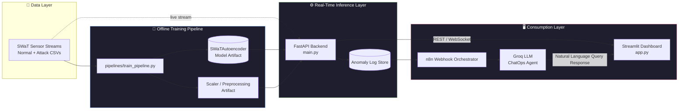

# ⚡ Anomify: Real-Time IoT Anomaly Detection

**Production-grade anomaly detection for Industrial Control Systems (ICS/IoT) — catching cyberattacks hidden in sensor noise, in real time.**

Anomify is a decoupled, end-to-end MLOps system that ingests high-frequency sensor telemetry from the **SWaT (Secure Water Treatment)** testbed, flags anomalous behavior using a custom deep autoencoder, and surfaces the results through a live dashboard and a natural-language ChatOps agent — enabling operators to query attack history without writing a single SQL query.

<p align="left">
  
  
  
  
  
  
</p>

---

## 1. Project Overview

Industrial Control Systems (ICS) generate dense, correlated, multi-sensor time-series data where cyberattacks manifest as **subtle deviations** rather than obvious spikes — making traditional threshold-based monitoring insufficient. Anomify addresses this by learning the *reconstruction manifold* of normal plant behavior and flagging any sample whose reconstruction error exceeds a statistically calibrated threshold.

| | |
|---|---|
| **Dataset** | SWaT (Secure Water Treatment) — 51 sensor/actuator channels across 6 process stages (P1–P6) |
| **Problem Type** | Unsupervised anomaly detection / semi-supervised (trained on normal-only data) |
| **Primary Model** | Custom `SWaTAutoencoder` (dense bottleneck architecture, TensorFlow/Keras) |
| **Latency Target** | Real-time / near-real-time inference via FastAPI |
| **Operator Interface** | Streamlit live dashboard + n8n/Groq LLM ChatOps agent |

The system is intentionally **decoupled** — training, inference, presentation, and automation each live in independent, replaceable components, which is what allows the model to be retrained or swapped without touching the serving layer, and the UI to be redesigned without touching the model.

---

## 2. System Architecture

The pipeline separates **offline training** from **online inference**, with the FastAPI backend acting as the single source of truth that both the Streamlit UI and the n8n ChatOps agent consume.



**Flow summary:** Sensor data trains the autoencoder offline → the frozen model + scaler are loaded by the FastAPI inference service → incoming streams are scored in real time → anomalies are logged and pushed to the Streamlit dashboard → n8n listens on the anomaly log via webhook and routes natural-language queries to Groq, allowing operators to "chat" with the incident history.

---

## 3. Key MLOps Features

- **🔁 Decoupled Train/Serve Boundary** — The `SWaTAutoencoder` is trained and versioned independently of the inference service; swapping model artifacts requires no backend code changes.
- **📥 Robust Ingestion Pipeline** — Pandas + PyArrow-backed loaders handle the SWaT dataset's mixed normal/attack CSVs with optimized dtype inference and chunked reads to control memory footprint.
- **🧩 Modular, Config-Driven Design** — Preprocessing, model architecture, and thresholding logic are isolated in `src/`, with runtime parameters externalized to `configs/` rather than hardcoded.
- **⚡ Real-Time Alerting** — The FastAPI layer scores incoming samples against a calibrated reconstruction-error threshold and streams anomaly events to the dashboard with minimal latency.
- **🗣️ LLM-Augmented Observability** — A Groq-backed LLM, orchestrated via n8n webhooks, lets operators query anomaly history in plain English (e.g., *"how many attacks on P3 in the last hour?"*) instead of writing manual queries against logs.
- **🧵 Deterministic Threading Control** — Explicit `OMP_NUM_THREADS` / `OPENBLAS_NUM_THREADS` / oneDNN environment configuration prevents thread oversubscription and uncontrolled memory growth on constrained inference hosts.
- **🧪 Reproducible Environments** — Pinned `requirements.txt` and isolated `.venv` ensure training and inference runs are reproducible across machines.

---

## 4. Repository Structure

```text
anomify/
├── configs/                   # Environment & model hyperparameter configs (YAML/JSON)
│   └── model_config.yaml
│
├── data/
│   └── raw/                   # SWaT normal & attack CSVs (not version-controlled)
│       ├── SWaT_Normal.csv
│       └── SWaT_Attack.csv
│
├── pipelines/
│   └── train_pipeline.py      # End-to-end training entrypoint (preprocess → fit → export)
│
├── src/
│   ├── data/                  # Ingestion & preprocessing (Pandas/PyArrow loaders, scalers)
│   ├── models/
│   │   └── swat_autoencoder.py   # Custom SWaTAutoencoder (TensorFlow/Keras)
│   ├── inference/             # Scoring logic, threshold calibration
│   └── utils/                 # Logging, env/thread configuration helpers
│
├── artifacts/                 # Trained model weights + fitted scalers (generated)
│
├── main.py                    # FastAPI application entrypoint (inference API)
├── app.py                     # Streamlit dashboard entrypoint
│
├── requirements.txt
├── .env.example
└── README.md
```

---

## 5. Getting Started (Local Setup)

### 5.1 Environment Setup

```bash
# Clone the repository
git clone https://github.com/mohamed-hamada111/Real-Time_Anomaly_Detection_IoT_Sensor_Streams.git anomify
cd anomify

# Create and activate a virtual environment
python -m venv .venv

# Windows
.venv\Scripts\activate

# macOS / Linux
source .venv/bin/activate
```

### 5.2 Install Dependencies

```bash
pip install --upgrade pip
pip install -r requirements.txt
```

### 5.3 ⚠️ Important — Module-Based Launchers Only

Do **not** invoke `uvicorn` or `streamlit` directly from the shell when working inside the project's virtual environment. Global launcher shims frequently resolve to an absolute path outside `.venv`, silently breaking relative imports (`src.*`, `configs.*`) and environment variable inheritance (thread limits, model paths).

**Always launch via the Python module flag** so execution is bound to the active interpreter and working directory:

```bash
# ✅ Correct
python -m uvicorn main:app --reload
python -m streamlit run app.py

# ❌ Avoid — may resolve to a stale global install
uvicorn main:app --reload
streamlit run app.py
```

---

## 6. ML Lifecycle Execution

### 6.1 Data Placement

Place the raw SWaT CSVs under `data/raw/`, preserving the normal/attack split expected by the ingestion loader:

```text
data/raw/
├── SWaT_Normal.csv     # Attack-free baseline — used to fit the autoencoder
└── SWaT_Attack.csv     # Mixed normal + attack traffic — used for threshold calibration/eval
```

### 6.2 Run the Training Pipeline

```bash
python pipelines/train_pipeline.py
```

This executes, in order:

1. **Ingestion** — chunked load of raw CSVs via Pandas/PyArrow, dtype normalization, timestamp parsing.
2. **Preprocessing** — feature scaling (fit on normal-only data), train/validation split.
3. **Training** — `SWaTAutoencoder` fit against reconstruction loss (MSE) with early stopping.
4. **Threshold Calibration** — reconstruction-error percentile computed against the validation/attack split to set the operating anomaly threshold.
5. **Artifact Export** — model weights and fitted scaler serialized to `artifacts/` for consumption by the inference service.

---

## 7. Running the Services

Anomify's backend and frontend are independent processes and must be run **concurrently** in separate terminals (both inside the activated `.venv`).

**Terminal 1 — FastAPI Inference Backend**

```bash
python -m uvicorn main:app --reload --host 0.0.0.0 --port 8000
```

**Terminal 2 — Streamlit Dashboard**

```bash
python -m streamlit run app.py
```

| Service | Default URL | Purpose |
|---|---|---|
| FastAPI Backend | `http://localhost:8000` | Real-time scoring API, anomaly log endpoints, OpenAPI docs at `/docs` |
| Streamlit Dashboard | `http://localhost:8501` | Live sensor visualization, anomaly stream, alert feed |
| n8n Webhook Agent | *(self-hosted / cloud instance)* | Listens for anomaly events, routes natural-language queries to Groq |

---

## 8. Future Roadmap

Planned enhancements to move Anomify from prototype to fully productionized MLOps deployment:

- [ ] **Containerization** — Docker + Docker Compose for reproducible, one-command spin-up of backend, dashboard, and n8n.
- [ ] **CI/CD** — GitHub Actions pipeline for linting, unit tests, and automated model regression checks on every PR.
- [ ] **Experiment Tracking** — MLflow integration for training run logging, metric comparison, and artifact/model registry.
- [ ] **Model Drift Monitoring** — Statistical drift detection (e.g., PSI/KL-divergence on sensor distributions) with automated retraining triggers.
- [ ] **Cloud Deployment** — Azure Container Apps deployment target with autoscaling for the FastAPI inference layer.
- [ ] **Observability Stack** — Prometheus + Grafana for infrastructure and model-performance monitoring alongside the existing anomaly dashboard.
- [ ] **Model Versioning & Rollback** — Registry-backed hot-swap of production model artifacts without service downtime.

---

## License

Distributed under the MIT License. See `LICENSE` for details.
